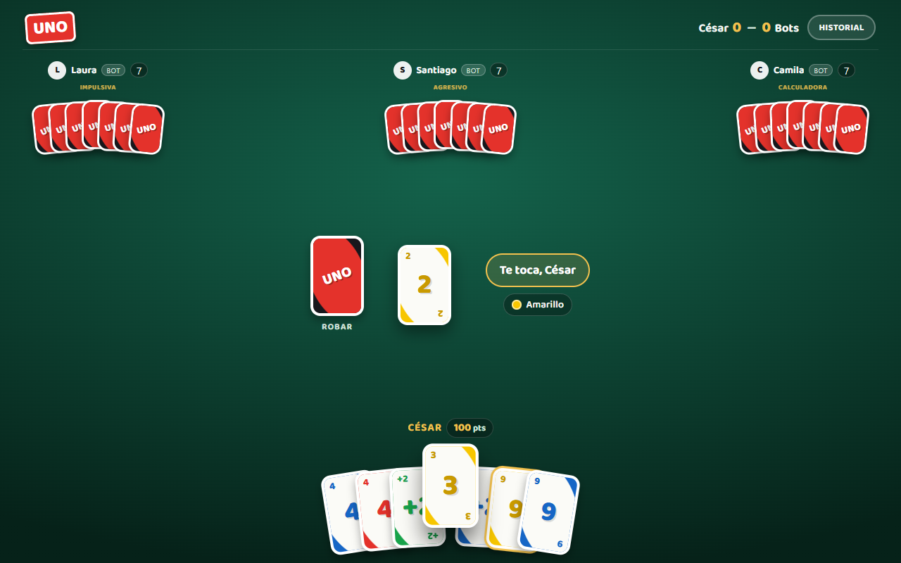
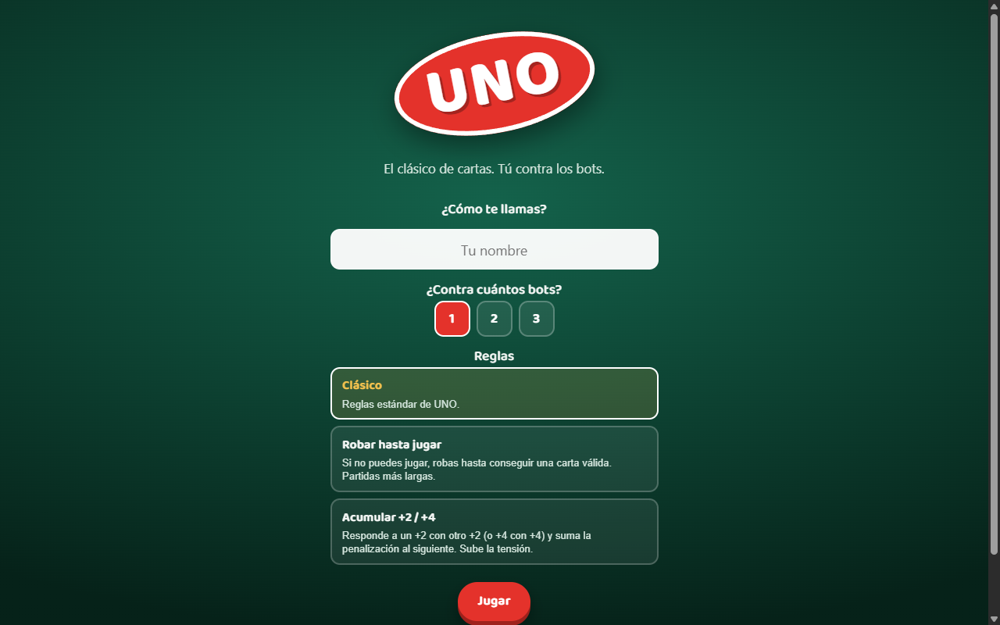

# UNO — mesa para una persona que se siente acompañada

[](https://github.com/ceeesar13/uno-game/actions/workflows/tests.yml)

**▶ [Juega ahora en el navegador](https://ceeesar13.github.io/uno-game/)** — sin cuenta, sin instalación, sin backend.



## La historia

Este proyecto nació como un reto de Platzi: construir un juego. Un clon de UNO
no diferencia a nadie — hay cientos en GitHub. Así que la pregunta cambió:
**¿cómo se siente jugar cartas contra alguien, cuando ese alguien es código?**

La respuesta fue construir una mesa donde los rivales no son un `setTimeout`
que tira la primera carta válida, sino **personajes que se pueden aprender a
leer**: Laura juega por impulso, Santiago castiga sin piedad, Camila calcula
cada descarte. Cada uno piensa a su ritmo, reacciona en personaje y telegrafía
su estilo — y ganarles se siente como ganarle a alguien, no a un generador de
números aleatorios.

La segunda apuesta fue la **honestidad verificable**: todo el azar del juego
(barajado, robos, decisiones de la CPU) sale de un generador sembrado que viaja
dentro del estado. La misma semilla y las mismas decisiones reproducen
exactamente la misma partida. Nadie tiene que confiar en que el juego no hace
trampa: se puede probar — y los tests lo prueban.

Todo eso con HTML, CSS y JavaScript vanilla: **sin frameworks, sin build, sin
dependencias de runtime y sin servidor**. La página que abres es el juego
completo.

> Proyecto de portafolio, **no afiliado ni respaldado por Mattel**. "UNO" es una
> marca de sus respectivos titulares; aquí se usa solo con fines educativos y de
> demostración.

## Qué lo hace distinto

- **Rivales con personalidad táctica.** 1–3 bots con estilos de juego reales y
  legibles (impulsiva, agresivo, calculadora), turnos con ritmo de mesa,
  reacciones en personaje y aviso de "¡UNO!".
- **Juego demostrablemente justo.** Azar sembrado y transportado en el estado:
  misma semilla ⇒ misma partida. El replay del historial de decisiones regenera
  el estado final exacto, y hay un test que lo garantiza.
- **Desafíos compartibles por URL.** La semilla, la configuración y las reglas
  viajan en el enlace: cualquier persona puede jugar exactamente tu misma
  partida, sin cuenta ni backend.
- **Mismas reglas para todos.** La legalidad de una jugada humana se evalúa con
  las mismas funciones del motor que usan los bots: nadie puede saltarse una
  regla que el motor no permita.
- **Accesible de verdad.** Cartas operables por teclado con nombre accesible,
  anuncios `aria-live` de cada evento, diálogos con gestión de foco,
  `prefers-reduced-motion` respetado y estados que no dependen solo del color.
- **Reglas de casa acotadas.** Clásico, robar hasta jugar, o acumular +2/+4 —
  elegidas al iniciar, explicadas antes de jugar. Y un modo de partida rápida
  de un clic.



## Cómo ejecutar

Jugar: **https://ceeesar13.github.io/uno-game/**

En local, al usar módulos ES el juego debe servirse por HTTP (no `file://`):

```bash
python serve.py        # servidor de previsualización sin caché en http://localhost:8420
# o cualquier estático, p. ej.:  npx serve .
```

## Tests

El motor es puro y determinista; se prueba con el runner nativo de Node, sin
dependencias:

```bash
node --test
```

La suite cubre: baraja estándar (108 cartas), barajado sembrado, reparto
determinista por semilla, validación de jugadas, legalidad del +4, efectos
(+2, salto, reversa), reglas de casa, terminación de partida y — lo más
importante — que **reproducir el historial de decisiones desde la misma semilla
regenera exactamente el mismo estado final**.

## Arquitectura

Separación estricta entre reglas y presentación:

| Archivo | Responsabilidad |
|---|---|
| `engine.js` | Motor puro. Sin DOM. Reglas, estrategias de CPU, PRNG sembrado, historial y replay. Exporta funciones puras. |
| `game.js` | Capa de UI (módulo ES). Renderiza el estado, anima, anuncia por `aria-live` y traduce la entrada del usuario en movimientos del motor. |
| `index.html` | Estructura y diálogos accesibles. |
| `style.css` | Sistema visual, responsive (móvil/landscape) y estados de foco/deshabilitado. |
| `test/engine.test.js` | Tests deterministas del motor. |

### Decisiones clave

- **Aleatoriedad sembrada y transportada en el estado.** Todo lo aleatorio se
  deriva de un PRNG `mulberry32` cuyo estado viaja dentro del estado del juego.
  Esto habilita replay, depuración y desafíos compartibles sin backend.
- **Dos registros por partida.** `history` (eventos legibles, para el panel y el
  lector de pantalla) y `log` (decisiones canónicas, para el replay).
- **Sin `innerHTML` para datos de usuario.** Los nombres se insertan como texto.
- **Timers de CPU centralizados y cancelables**, para que ningún turno pendiente
  se dispare sobre una partida recién reiniciada.

## Hoja de ruta

Las siguientes etapas están documentadas en [`docs/REVIEW.md`](docs/REVIEW.md):
profundizar la personalidad táctica observable de los rivales, voz para los
bots (síntesis en el navegador primero, clips pregenerados después) y desafíos
asíncronos. Multiplayer en tiempo real, cuentas, rankings y monetización quedan
explícitamente fuera de alcance.
